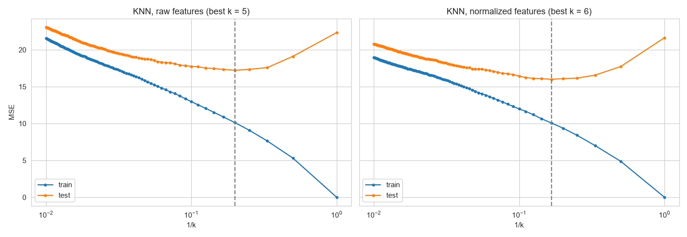
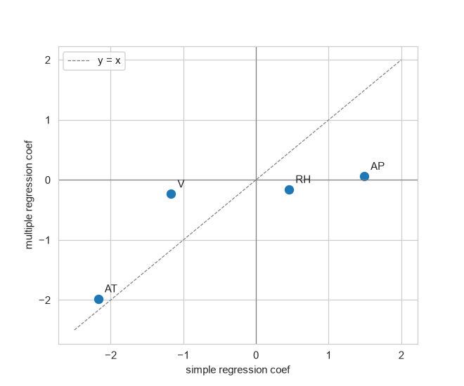

# DSCI 552 HW2 - Combined Cycle Power Plant

Linear regression and KNN regression on the UCI Combined Cycle Power Plant dataset.

The task is to predict the net hourly electrical output of the plant (PE, in MW) from 4 ambient variables:
temperature (AT), exhaust vacuum (V), ambient pressure (AP) and relative humidity (RH).
There are 9568 hourly readings from 2006-2011 with the plant running at full load.

All the work is in [HW2_CCPP.ipynb](HW2_CCPP.ipynb). It's already run, so the outputs and plots show up on GitHub.

## What's in the notebook

- (b) data size, pairwise scatterplots, summary stats
- (c) simple linear regression for each predictor + outliers
- (d) multiple regression with all 4 predictors
- (e) univariate vs multiple regression coefficients
- (f) cubic terms to check for nonlinearity
- (g) pairwise interactions
- (h) squared + interaction terms with backward elimination, 70/30 train/test split
- (i) KNN regression for k = 1 to 100, raw vs normalized features
- (j) KNN vs linear regression
- extra: 5x2 CV paired t-test using all 5 shuffled sheets (the dataset readme mentions this)

## Results

Test MSE on the 70/30 split (random_state = 552):

| model | test MSE |
|---|---|
| linear, 4 predictors | 21.74 |
| 2nd order terms after elimination | 19.08 |
| KNN raw features (k = 5) | 17.22 |
| KNN normalized features (k = 6) | 16.00 |

Some things I found:
- Temperature alone explains about 90% of the variance in PE.
- RH has a positive slope on its own but a negative one in the multiple regression. Humid days are usually cooler, that's why.
- Normalized KNN beats linear regression in all 10 folds of the 5x2 CV test (t = 9.5, p = 0.0002).
  The regression model is still easier to interpret though.





## Running it

```
pip install -r requirements.txt
jupyter notebook HW2_CCPP.ipynb
```

The notebook reads `Folds5x2_pp.xlsx` from the same folder and saves plots to `figures/`.

## Data

UCI Machine Learning Repository: https://archive.ics.uci.edu/dataset/294/combined+cycle+power+plant

- Pınar Tüfekci, Prediction of full load electrical power output of a base load operated combined cycle power plant using machine learning methods,
  International Journal of Electrical Power & Energy Systems, Volume 60, 2014, Pages 126-140. http://dx.doi.org/10.1016/j.ijepes.2014.02.027
- Heysem Kaya, Pınar Tüfekci, Sadık Fikret Gürgen, Local and Global Learning Methods for Predicting Power of a Combined Gas & Steam Turbine, ICETCEE 2012, pp. 13-18.

## AI usage disclaimer

I used Claude only to understand the concepts and the assignment, to set up a format, to ask general programming questions, and to generate sample code that explains how certain programming constructs work.
Claude Code was used to add explanatory comments to some notebook cells, which also helped me understand the concepts. The analysis and code are my own.
